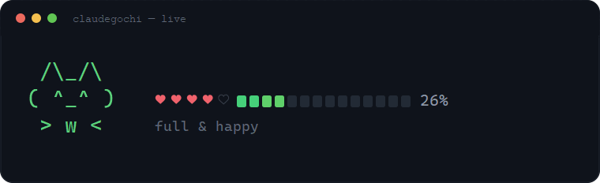

# cc-statusline

A useful status line for Claude Code: context remaining, plus 🐱 **claudegochi** —
a tamagotchi whose mood reflects your session.

<p align="center">
  
</p>

## Install in one line

Requires Node.js, git and the Claude Code CLI. Paste the command — it clones and installs.

**Windows (PowerShell):**
```powershell
irm https://raw.githubusercontent.com/denipesto/cc-statusline/main/install.ps1 | iex
```

**macOS / Linux / Git Bash:**
```sh
curl -fsSL https://raw.githubusercontent.com/denipesto/cc-statusline/main/install.sh | sh
```

The bootstrap clones the repo into `~/.cc-statusline` and runs the installer.
Then **restart Claude Code**.

### Uninstall in one line

```powershell
irm https://raw.githubusercontent.com/denipesto/cc-statusline/main/uninstall.ps1 | iex
```
```sh
curl -fsSL https://raw.githubusercontent.com/denipesto/cc-statusline/main/uninstall.sh | sh
```

Removes the status line from `settings.json` (your config and the backup are left in place).

### Manual (clone + installer)

```sh
git clone https://github.com/denipesto/cc-statusline.git
cd cc-statusline
node bin/install.mjs
```

The installer writes `statusLine` into `~/.claude/settings.json` using **absolute paths
to node and the script** (computed from the clone location — PATH doesn't matter, the
folder can live anywhere), backs up `settings.json.bak`, and leaves the rest of the config
untouched. From the project folder: `npm run setup`.

### Options

```sh
node bin/install.mjs --mode tamagotchi   # install and switch the cat on
node bin/install.mjs --mode normal       # install in context-bar mode
node bin/install.mjs --uninstall         # remove statusLine from settings.json
```

(`npm run remove` = `--uninstall`.)

## Configure — `config.json`

Re-read on every render, no restart needed.

| Field | Values | What it does |
|---|---|---|
| `mode` | `"normal"` \| `"tamagotchi"` | which mode to render |
| `widgets` | `["context", ...]` | which widgets and order (normal mode) |
| `petStyle` | `"sprite"` \| `"compact"` | cat as 3 lines / 1 line |
| `petName` | string | pet name |
| `petNameProject` | `true` \| `false` | show the current project's folder name instead of `petName` |
| `contextWindow` | `null` \| number | context window (`null` = auto: 200k / 1M for `[1m]`) |
| `separator` | string | separator between widgets |

## Languages

English is the default; **Русский** ships in the box. Pick a language in `config.json`:

```json
{ "lang": "ru" }
```

…or at install time: `node bin/install.mjs --lang ru`.

### Add your language (PRs welcome)

1. Copy `locales/en.json` to `locales/<code>.json` (e.g. `de.json`, `fr.json`, `ja.json`).
2. Translate the **values** only — keep the keys and any `/commands` intact.
3. Set `"lang": "<code>"` in `config.json` and run `npm run demo` to check it.
4. Open a pull request.

Missing keys fall back to English, so partial translations work fine. See
[`locales/README.md`](./locales/README.md) for the full guide.

## Development

```sh
npm run demo    # render the cat in every mood (synthetic fixtures)
```

Ideas and backlog live in [IDEAS.md](./IDEAS.md).

## License

MIT
